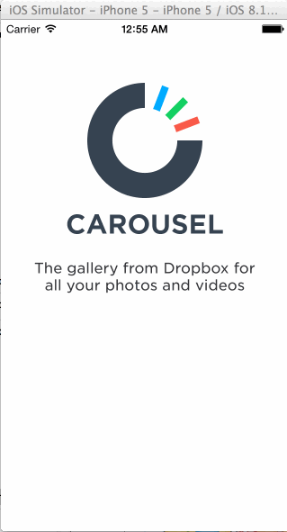

# carousel
Week 2 Assignment

Time: I spent around 15 hours on the exercise. 

What does the app can do?

User can choose to sign in from the initial welcome screen, 
go through a quick tutorial by paging through 4 screens,
navigate to the conversation screen and come back,
show the settings screen and dismiss it. 

What is missing from the app?

The biggest functionality missing from the app is the various sign in validation scenarios. But this is how much I can accomplish given the time I can work on this project this week.

The gif is created with LICEcap.
